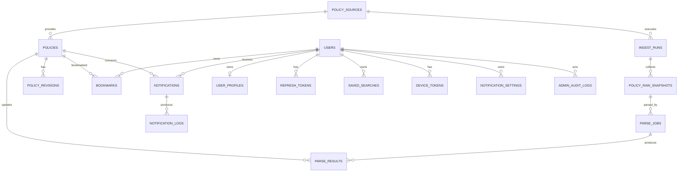

# 청년꿀통 (youth-kkultong) — ARCHITECTURE.md

> 기준: PRD v0.4  
> 목적: 프로젝트 전체 기술 구조, API 경계, 데이터 모델, MVP별 확장 방식을 정의하는 기준 문서  
> 원칙: **웹 우선 / 비로그인 탐색 우선 / 규칙 기반 매칭 / MVP별 점진 확장**

---

## 1. 전체 방향

청년꿀통은 정부·지자체 지원 정책을 한곳에 모아 보여주고, 사용자가 나이·지역·상태·가구원 수·소득 등의 조건을 선택적으로 입력할수록 자신과 맞지 않는 정책을 더 많이 제외해 주는 웹 서비스다.

초기 핵심 흐름:

```text
웹 접속
→ 전체 정책 목록
→ 조건 선택
→ 결과 정교화
→ 정책 상세
→ 공식 공고 이동
```

로그인은 초기 필수 기능이 아니다.

---

## 2. MVP별 시스템 범위

### MVP 0 — 정책 데이터 준비

목표: 실제 정책 30~50건을 DB에 넣고 데이터 모델을 검증한다.

포함:
- PostgreSQL
- 핵심 정책 스키마
- 지역/중위소득 기준 데이터
- JSON 정책 파일
- JSON import CLI
- 정책 입력 검증

제외:
- 사용자 로그인
- 관리자 웹 화면
- 자동 수집
- Redis
- BullMQ
- LLM

---

### MVP 1 — 비로그인 정책 탐색/매칭

목표: 사용자가 로그인 없이 실제 정책을 탐색하고 조건을 넣어 결과를 좁힐 수 있는지 검증한다.

포함:
- Next.js 웹
- NestJS API
- 정책 목록
- 정책 상세
- 카테고리/지역/나이/상태/가구원/소득 조건
- 선택형 매칭
- 공식 공고 링크

제외:
- 사용자 로그인
- 북마크
- 자동 수집
- 알림
- Redis
- BullMQ
- LLM

---

### MVP 2 — 정책 수집/운영 자동화

목표: 정책을 사람이 매번 JSON으로 넣는 부담을 줄인다.

추가:
- 공공 API 수집
- Worker
- Raw 원문 저장
- Sanitizer
- 변경 감지
- 수집에서 사라진 정책 감지
- 운영자 정책 관리 화면
- 공개/비공개
- 검증일 관리
- 정책 변경 이력

LLM은 아직 필수가 아니다.

---

### MVP 3 — 로그인/개인화

추가:
- 카카오 로그인
- 사용자 계정
- 프로필 저장
- 저장된 조건
- 북마크
- 관심 정책 관리

---

### MVP 4 — 알림/일정 관리

추가:
- D-Day
- 캘린더
- 신청 시작 알림
- 마감 알림
- 정책 변경 알림
- 새 정책 알림
- 알림 설정

이 단계부터 예약/재시도 작업량에 따라 Redis/BullMQ를 도입한다.

---

### MVP 4 이후 — LLM 운영 자동화

추가:
- LLM 정책 구조화
- Parse Job
- 검수 대기열
- 실패 재처리
- PDF/HWP 처리
- 중복 정책 탐지
- 제한적 자동 공개

LLM 결과는 검증 없이 공개 정책에 직접 반영하지 않는다.

---

## 3. 기술 스택

### Frontend

| 항목 | 선택 |
|---|---|
| Framework | Next.js, App Router |
| Language | TypeScript strict |
| Styling | Tailwind CSS |
| Validation | Zod |
| Rendering | Server Component 우선, 필요한 곳만 Client Component |
| API 호출 | native fetch 기반 |
| 테스트 | Testing Library + Playwright 핵심 E2E |

초기에는 Redux 같은 전역 상태 관리 도구를 사용하지 않는다.

---

### Backend

| 항목 | 선택 |
|---|---|
| Runtime | Node.js 22 LTS |
| Framework | NestJS 11 |
| Language | TypeScript strict |
| DB | PostgreSQL 16 |
| ORM | TypeORM |
| Validation | Zod |
| API | REST JSON |
| Logging | nestjs-pino |
| Docs | Swagger/OpenAPI |
| Rate limit | @nestjs/throttler |
| Test | Jest, Supertest, Testcontainers |
| Load test | k6 |

---

### Package / Repository

pnpm workspace 기반 monorepo를 사용한다.

```text
youth-kkultong/
├─ apps/
│  ├─ web/                  # Next.js frontend
│  └─ server/               # NestJS backend
├─ packages/
│  └─ contracts/            # FE/BE 공유 Zod schema, enum, DTO type
├─ data/
│  └─ policies/             # MVP0 실제 정책 JSON
├─ docs/
│  ├─ PRD.md
│  ├─ ARCHITECTURE.md
│  ├─ ARCHITECTURE_SUMMARY.md
│  ├─ mvp/
│  └─ plans/
├─ docker-compose.yml
├─ pnpm-workspace.yaml
└─ package.json
```

DB Entity 자체는 frontend와 공유하지 않는다.

---

## 4. 시스템 구조

### MVP 1

```text
Browser
  │
  ▼
Next.js Web
  │ HTTPS/JSON
  ▼
NestJS API
  │ SQL
  ▼
PostgreSQL
```

### MVP 2 이후

```text
Browser
  │
  ▼
Next.js Web
  │
  ▼
NestJS API ───────────────┐
  │                       │
  ▼                       ▼
PostgreSQL             Worker
                          │
                          ▼
                     Public APIs
```

### MVP 4 이후

```text
Next.js
   │
NestJS API
   │
   ├── PostgreSQL
   └── Redis/BullMQ
          │
        Worker
```

---

## 5. Backend 모듈

```text
apps/server/src/
├─ main.ts
├─ app.module.ts
├─ common/
│  ├─ config/
│  ├─ errors/
│  ├─ filters/
│  ├─ pipes/
│  ├─ guards/
│  └─ logging/
├─ database/
│  ├─ migrations/
│  ├─ seeds/
│  └─ datasource.ts
├─ modules/
│  ├─ meta/
│  ├─ policies/
│  │  ├─ policy-query.service.ts
│  │  ├─ policy-write.service.ts
│  │  ├─ repositories/
│  │  └─ entities/
│  ├─ matching/
│  ├─ ingest/              # MVP2
│  ├─ admin/               # MVP2
│  ├─ auth/                # MVP3
│  ├─ users/               # MVP3
│  ├─ profiles/            # MVP3
│  ├─ bookmarks/           # MVP3
│  ├─ notifications/       # MVP4
│  └─ parser/              # MVP4 이후
└─ cli/
   └─ import-policies.ts
```

---

## 6. Frontend 구조

```text
apps/web/
├─ app/
│  ├─ page.tsx
│  ├─ policies/[id]/page.tsx
│  ├─ admin/               # MVP2
│  ├─ login/               # MVP3
│  └─ me/                  # MVP3
├─ components/
│  ├─ policy/
│  ├─ search/
│  └─ common/
├─ lib/
│  ├─ api/
│  ├─ format/
│  └─ constants/
└─ types/
```

---

## 7. 핵심 정책 모델

### Constraint

```ts
type Constraint<T> =
  | { kind: 'ANY' }
  | { kind: 'RULE'; value: T }
  | { kind: 'UNKNOWN' };
```

의미:

- `ANY`: 정책에 해당 제한 없음
- `RULE`: 비교 가능한 명확한 조건
- `UNKNOWN`: 정책 조건 자체가 모호하거나 시스템에서 정확히 표현 불가

---

### 사용자 검색 조건

```ts
interface SearchCriteria {
  age?: number;
  regionCode?: string;
  statuses?: UserStatus[];
  householdSize?: number;
  householdMonthlyIncome?: number;
}
```

사용자가 값을 입력하지 않은 경우와 정책 조건이 `UNKNOWN`인 경우를 구분한다.

---

## 8. 매칭 결과 모델

```ts
type FieldEvaluation =
  | 'MATCH'
  | 'MISMATCH'
  | 'POLICY_UNKNOWN'
  | 'NOT_PROVIDED';
```

의미:

- `MATCH`: 사용자가 입력했고 조건 일치
- `MISMATCH`: 사용자가 입력했고 조건 불일치
- `POLICY_UNKNOWN`: 정책 조건 자체가 불명확
- `NOT_PROVIDED`: 사용자가 해당 정보를 입력하지 않음

최종 UI용 상태:

```ts
type MatchSummary =
  | 'UNASSESSED'
  | 'MATCHED'
  | 'PARTIAL'
  | 'NEEDS_CHECK';
```

- `UNASSESSED`: 사용자 조건 입력 없음
- `MATCHED`: 입력된 조건이 모두 맞고 정책 자체에도 핵심 미확인 조건 없음
- `PARTIAL`: 입력된 조건은 맞지만 아직 사용자가 입력하지 않은 비교 가능 조건이 있음
- `NEEDS_CHECK`: 정책 자체에 UNKNOWN 또는 별도 확인 조건 있음

`MATCHED`는 법적 자격 확정 의미가 아니다.

---

## 9. 매칭 엔진 원칙

```ts
evaluatePolicy(
  policy: MatchablePolicy,
  criteria: SearchCriteria,
  context: MatchContext,
): PolicyEvaluation
```

매칭 엔진은 순수 TypeScript 함수로 구현한다.

매칭 엔진 내부에서 하지 않는 것:
- DB 접근
- HTTP 호출
- 환경변수 직접 접근
- 현재 시간 직접 조회
- LLM 호출

날짜/중위소득 기준표 등은 `MatchContext`로 주입한다.

---

## 10. 주요 API

기본 경로:

```text
/api/v1
```

### MVP1 Public API

#### 정책 목록

```http
GET /api/v1/policies?page=1&size=20&category=HOUSING
```

단순하고 민감하지 않은 필터에 사용한다.

#### 선택형 검색/매칭

```http
POST /api/v1/policies/search
```

예:

```json
{
  "category": ["HOUSING"],
  "age": 27,
  "regionCode": "11",
  "statuses": ["JOB_SEEKER"],
  "householdSize": 1,
  "householdMonthlyIncome": 1800000,
  "page": 1,
  "size": 20,
  "sort": "DEADLINE"
}
```

이 API는 **조회 전용이며 서버 상태를 변경하지 않는다.**

POST를 쓰는 이유:
1. 검색 조건 구조가 복잡해질 수 있음
2. 소득 같은 민감값을 URL query string에 남기지 않기 위함
3. 긴 query string보다 body가 관리하기 쉬움

단순 필터는 GET `/policies`, 개인 조건 기반 검색은 POST `/policies/search`로 분리한다.

#### 정책 상세

```http
GET /api/v1/policies/:id
```

#### 기준 데이터

```http
GET /api/v1/meta/regions
GET /api/v1/meta/categories
GET /api/v1/meta/statuses
```

---

## 11. 정책 데이터 구조

### benefitAmount

```ts
type BenefitAmount =
  | {
      kind: 'FIXED';
      amountWon: number;
      text: string;
    }
  | {
      kind: 'MONTHLY';
      amountWon: number;
      months: number | null;
      text: string;
    }
  | {
      kind: 'RATE';
      text: string;
    }
  | {
      kind: 'IN_KIND';
      text: string;
    }
  | {
      kind: 'UNKNOWN';
      text: string;
    };
```

정렬값:
- FIXED: `amountWon`
- MONTHLY + months 있음: `amountWon * months`
- 나머지: null

---

### 나이 조건

```ts
type AgeBasis =
  | { kind: 'TODAY' }
  | { kind: 'FIXED_DATE'; date: string }
  | { kind: 'YEAR_DIFF'; year: number }
  | { kind: 'BIRTH_YEAR' };

interface AgeRule {
  min: number | null;
  max: number | null;
  basis: AgeBasis;
}
```

---

### 소득 조건

```ts
interface IncomeRule {
  min: number | null;
  max: number | null;
  basisConfirmed: true;
}
```

단위는 기준 중위소득 비율 `%`.

정책의 소득 산정 방식 또는 가구 정의가 서비스 기준과 다르면 `RULE`로 저장하지 않고 `UNKNOWN`으로 둔다.

---

## 12. 전체 DB ERD



전체 ERD는 미래 구조까지 보여주지만 실제 테이블은 MVP별 migration으로 추가한다.

---

## 13. MVP0/MVP1 DB

### regions

```text
regions
- code              text PK
- parent_code       text NULL FK -> regions.code
- level             smallint NOT NULL
- name              text NOT NULL
- active            boolean NOT NULL default true
```

---

### median_income_table

```text
median_income_table
- year              smallint
- household_size    smallint
- amount            bigint
PK (year, household_size)
```

다른 연도나 가구원 수 값을 대신 사용하지 않는다.

---

### policy_sources

```text
policy_sources
- id                smallserial PK
- code              text UNIQUE NOT NULL
- name              text NOT NULL
- type              text NOT NULL       # MANUAL | API
- enabled           boolean NOT NULL
- base_url          text NULL
- created_at        timestamptz NOT NULL
- updated_at        timestamptz NOT NULL
```

MVP0 초기 seed:

```text
MANUAL
```

---

### policies

```text
policies
- id                                  uuid PK
- source_id                           smallint NULL FK
- external_id                         text NULL

- title                               varchar(200) NOT NULL
- agency                              varchar(120) NOT NULL
- category                            text NOT NULL

- benefit_summary                     varchar(300) NOT NULL
- benefit_amount                      jsonb NOT NULL
- conditions                          jsonb NOT NULL

- has_unresolved_eligibility_condition boolean NOT NULL
- unresolved_condition_note           text NULL

- required_docs                       text[] NOT NULL

- apply_start                         date NULL
- apply_end                           date NULL
- is_always_open                      boolean NOT NULL

- official_url                        text NOT NULL

- source_status                       text NOT NULL
                                      # ACTIVE | NOT_SEEN | CLOSED
- is_published                        boolean NOT NULL
- last_verified_at                    timestamptz NOT NULL

- created_at                          timestamptz NOT NULL
- updated_at                          timestamptz NOT NULL
```

주요 index:

```text
(is_published, source_status, apply_end)
(category)
(last_verified_at)
```

---

## 14. MVP2 DB 추가

### ingest_runs

```text
ingest_runs
- id
- source_id
- status
- started_at
- finished_at
- fetched_count
- changed_count
- error_message
- created_at
```

### policy_raw_snapshots

```text
policy_raw_snapshots
- id
- ingest_run_id
- source_id
- external_id
- policy_id
- source_url
- raw_payload
- raw_text
- sanitized_text
- raw_hash
- sanitized_hash
- fetched_at
```

### policy_revisions

```text
policy_revisions
- id
- policy_id
- revision_no
- snapshot
- reason
- actor_type
- actor_user_id
- created_at
```

### admin_audit_logs

```text
admin_audit_logs
- id
- actor_type          # ADMIN | SYSTEM
- actor_user_id
- actor_name
- action
- target_type
- target_id
- diff
- created_at
```

---

## 15. MVP3 DB 추가

### users

```text
users
- id
- provider
- provider_user_id
- email
- nickname
- role                # USER | ADMIN
- created_at
- updated_at
```

### refresh_tokens

```text
refresh_tokens
- id
- user_id
- token_hash
- family_id
- expires_at
- revoked_at
- user_agent
- created_at
```

### user_profiles

```text
user_profiles
- user_id
- birth_date NULL
- region_sido_code NULL
- region_sigungu_code NULL
- household_monthly_income NULL
- household_size NULL
- statuses
- privacy_consent_at
- privacy_consent_version
- created_at
- updated_at
```

선택 입력 원칙 때문에 프로필 조건 컬럼은 nullable을 기본으로 한다.

### bookmarks

```text
bookmarks
- user_id
- policy_id
- created_at
PK (user_id, policy_id)
```

### saved_searches

여러 검색 조건 저장이 필요해질 때만 추가한다.

---

## 16. MVP4 DB 추가

### notification_settings

사용자 알림 설정.

### device_tokens

Web Push / 향후 모바일 push token.

### notifications

예약된 알림 본문과 상태.

### notification_logs

실제 발송 결과.

---

## 17. LLM 단계 DB 추가

### parse_jobs

LLM 작업 실행 상태/토큰/오류 기록.

### parse_results

LLM 구조화 결과와 운영자 검수 상태.

승인된 결과만 `PolicyWriteService`를 통해 `policies`에 반영한다.

---

## 18. DB Migration 전략

DB 테이블은 미래 구조를 한 번에 만들지 않는다.

MVP 진행 순서에 맞춰 migration을 추가한다.

예:

```text
001_mvp0_core_policy
002_mvp2_ingest
003_mvp2_policy_revision
004_mvp3_users_auth
005_mvp3_bookmarks
006_mvp4_notifications
007_llm_parse
```

Production에서는 TypeORM `synchronize=true`를 사용하지 않는다.

---

## 19. 정책 데이터 흐름

### MVP0

```text
공식 공고
→ 사람이 JSON 작성
→ Zod 검증
→ CLI import
→ PolicyWriteService
→ policies
```

### MVP2

```text
공공 API
→ Source Adapter
→ Raw Snapshot
→ Sanitizer
→ 운영자 확인
→ PolicyWriteService
→ policies
```

### LLM 단계

```text
Raw Snapshot
→ LLM Parse
→ Zod/도메인 검증
→ Parse Result
→ 운영자 승인
→ PolicyWriteService
→ policies
```

---

## 20. PolicyWriteService

Canonical policy 변경은 하나의 서비스로 통일한다.

```ts
PolicyWriteService.create(...)
PolicyWriteService.update(...)
PolicyWriteService.publish(...)
PolicyWriteService.unpublish(...)
PolicyWriteService.verify(...)
```

책임:
- Zod 검증
- 필드 간 검증
- 지역 코드 검증
- 날짜 검증
- 출처 검증
- transaction
- revision/audit 기록

---

## 21. 개인정보/검색 조건 처리

### 비로그인 MVP1

검색 조건은 영구 저장하지 않는다.

로그 금지:
- 소득
- 생년월일
- 상세 거주 정보
- 전체 request body

검색에서 나이가 필요하면 생년월일 대신 계산된 `age`만 전달하는 것을 우선한다.

### 로그인 이후

사용자가 명시적으로 저장한 정보만 `user_profiles`에 저장한다.

---

## 22. 보안

### MVP1

- CORS allowlist
- Rate limiting
- Zod validation
- security headers
- parameterized query/ORM
- 내부 stack 미노출

### MVP2 Admin

운영자 API에는 인증/권한 검사가 필요하다.

### MVP3

- OAuth state
- httpOnly Cookie
- Secure
- SameSite=Lax
- Access token short TTL
- Refresh rotation
- Refresh reuse detection
- Origin 검증

---

## 23. Pagination / Sorting

초기:

```text
page = 1
size = 20
max size = 50
```

MVP1은 offset pagination으로 시작한다.

정렬에는 항상 마지막 tie-breaker로 `id`를 둔다.

예:

```text
apply_end ASC NULLS LAST
title ASC
id ASC
```

---

## 24. 공개 정책 조건

Public API는 기본적으로 다음 정책만 노출한다.

```text
is_published = true
source_status = ACTIVE
apply_end가 없거나 오늘 이상
last_verified_at이 HIDE_DAYS 이내
```

마감 정책은 삭제하지 않고 운영 DB에 남긴다.

---

## 25. 성능 전략

MVP1:
- 정책 30~1,000건
- DB에서 공개 정책 조회
- Node.js에서 규칙 기반 매칭
- 결과 정렬/페이지 처리
- 캐시 없음

다음 상황이 실제 측정될 때만 캐시를 검토한다.
- 정책 10,000건 이상
- p95 목표 초과
- DB read 병목
- 반복 검색 비율 증가

---

## 26. Worker / Queue 전략

### MVP2

수집용 Worker만 추가한다.

초기 수집은 Redis/BullMQ 없이도 가능하다.

### MVP4 이후

다음 작업이 늘면 Redis/BullMQ를 도입한다.
- 알림 예약
- LLM parse
- 실패 재시도
- 첨부파일 처리
- 대량 재수집

---

## 27. 테스트 전략

### Unit

- matching engine
- age basis
- income calculation
- date logic
- benefit amount sort
- Zod validation

### Integration

- JSON import
- 정책 조회
- 정책 검색
- 정책 상세
- PolicyWriteService transaction
- 수집/운영 API

### E2E

핵심 흐름:

```text
전체 정책
→ 조건 입력
→ 결과 감소
→ 상세
→ 공식 공고
```

### Load

초기 목표 예:

```text
활성 정책 1,000건
동시 50명
50 RPS
5분
p95 500ms 이하
```

---

## 28. Docker

### MVP1

```text
web
api
postgres
```

### MVP2

```text
web
api
worker
postgres
```

### MVP4+

```text
web
api
worker
postgres
redis
```

---

## 29. 환경변수

### Core

```text
NODE_ENV
DATABASE_URL
WEB_ORIGIN
API_ORIGIN
STALE_DAYS
HIDE_DAYS
MAX_HOUSEHOLD_SIZE
```

### MVP3

```text
JWT_ACCESS_SECRET
JWT_REFRESH_SECRET
JWT_ACCESS_TTL
JWT_REFRESH_TTL
OAUTH_KAKAO_ID
OAUTH_KAKAO_SECRET
OAUTH_REDIRECT_BASE
COOKIE_DOMAIN
```

### MVP4+

```text
REDIS_URL
```

### LLM

```text
LLM_API_KEY
LLM_MODEL_PRIMARY
LLM_MODEL_FALLBACK
```

모든 환경변수는 시작 시 검증한다.

---

## 30. 핵심 아키텍처 결정 요약

1. Next.js + NestJS + PostgreSQL monorepo
2. MVP1은 비로그인 사용 가능
3. 실제 정책 데이터는 MVP0에서 수동 JSON import
4. 사용자 미입력과 정책 `UNKNOWN`을 분리
5. 매칭은 deterministic rule engine
6. 단순 목록은 GET, 복잡한 개인 조건 검색은 `POST /policies/search`
7. Canonical policy 변경은 `PolicyWriteService`로 통일
8. Redis/BullMQ는 초기 미사용
9. 자동 수집은 MVP2
10. 로그인/개인화는 MVP3
11. 알림/일정은 MVP4
12. LLM은 운영 자동화 단계에서 도입
13. DB는 MVP별 migration으로 확장
14. 정책 조건은 초기 JSONB로 저장하고 코드에서 해석
15. 공식 공고가 최종 기준이며 시스템은 자격을 법적으로 확정하지 않는다.
